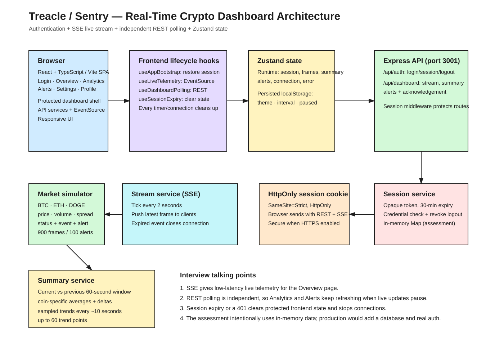
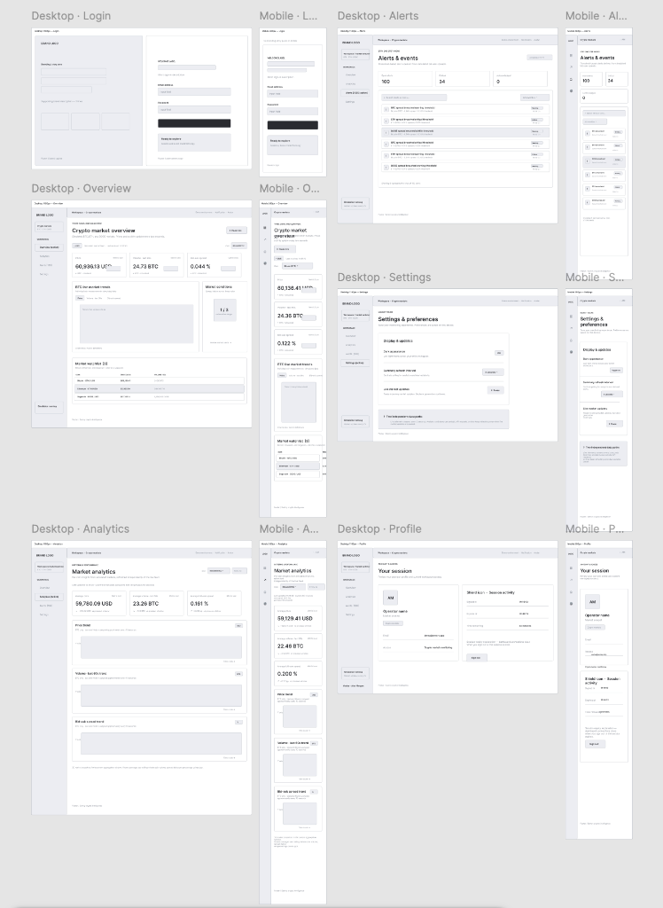

# Sentry · Crypto market simulator

> 🚀 **Live Production Demo:** [**https://sentrytreacle.netlify.app/**](https://sentrytreacle.netlify.app/)  
> **Demo Credentials:** `demo@sentry.app` · `Crypto123!`

## System architecture



The diagram highlights cookie-based session authentication, live telemetry delivered over Server-Sent Events (SSE), and independent REST polling for the dashboard summaries and alerts.

## Responsive wireframes

[](https://www.figma.com/design/wHIwIh0L1HZT2w1vCOsbun/Treacle-%E2%80%94-Desktop-and-Mobile-Wireframes?node-id=0-1&t=M4AgqDMLBdSWxHyL-1)

### 🎨 [👉 Click Here to View Full Interactive Wireframes in Figma ↗](https://www.figma.com/design/wHIwIh0L1HZT2w1vCOsbun/Treacle-%E2%80%94-Desktop-and-Mobile-Wireframes?node-id=0-1&t=M4AgqDMLBdSWxHyL-1)



## Run locally

Requires Node.js 20.19+ (or 22.12+).

```sh
npm install
npm run dev
```

Open http://127.0.0.1:5173. Vite proxies `/api` to Express on port 3001.

**Demo login:** `demo@sentry.app` / `Crypto123!`

```sh
npm run build # TypeScript check and production bundle
npm start     # Serve the production build and API on http://127.0.0.1:3001
```

## Market behavior

- The backend generates a frame containing BTC, ETH, and DOGE measurements every 2 seconds. Fictional reference prices are $60,000, $3,000, and $0.12; these are not current market quotes.
- Each coin has three displayed metrics: price in USD, trailing 60-second traded volume in units of that coin, and bid–ask spread as a percentage of price. Each tick generates a simulated trade quantity; volume sums those quantities from the trailing minute.
- Each reading includes a timestamp, status, and UPDATE/ALERT/RECOVERY event label. Spread is OK at or below 0.15%, WARN above 0.15% through 0.20%, and CRITICAL above 0.20%. These are demonstration thresholds, not market standards.
- A transition into a different abnormal status creates an alert. Repeated readings with the same status do not create duplicate alert records. Recovery appears on the live reading; acknowledgement records review and does not alter market conditions.
- Authenticated SSE provides the live feed. EventSource reconnects automatically; reconnection receives the latest frame without replaying missed frames. Pause closes only that browser's live connection.
- Summary and alert REST requests run independently every 5, 10 (default), or 15 seconds. Summaries include per-coin averages, absolute deltas versus the previous minute, and sampled historical trends. Prices are never averaged across different coins.
- Summary windows use timestamps relative to the latest frame. Volume averages represent average trailing-minute volume, not a sum of overlapping windows. Spread deltas are percentage-point differences; price deltas are USD; volume deltas are coin units.
- Five minutes of simulated frames seed startup history. Raw history retains 900 frames; alerts retain 100 entries; the browser retains 60 live frames. Historical trends sample every fifth frame, approximately every 10 seconds, retaining up to 60 points.
- DOGE prices retain six decimal places. Timestamps display in the browser's local timezone.

## Session and state

Random opaque session tokens are stored in HttpOnly, SameSite=Strict cookies. The backend validates sessions, expires them after 30 minutes, and revokes them on logout. Expiry clears protected frontend state, closes SSE, cancels polling, and redirects to login. API responses use `Cache-Control: no-store`.

Zustand holds runtime dashboard state. Theme, polling interval, and pause preferences persist under `sentry-crypto-preferences` in localStorage. Sessions, market history, and acknowledgements live in backend memory and reset on restart. For HTTPS, set `COOKIE_SECURE=true`. A production deployment would also need persistent storage and production authentication.

## Pages

| Route        | Features                                                                                                 |
| ------------ | -------------------------------------------------------------------------------------------------------- |
| `/login`     | Demo sign-in and validation feedback                                                                     |
| `/`          | Coin selection, three live metrics, chart tabs, market watchlist, snapshots, spread status, pause/resume |
| `/analytics` | Coin selection, polled averages, previous-window deltas, three historical charts                         |
| `/alerts`    | Search by coin or title, severity filtering, details, acknowledgement                                    |
| `/settings`  | Persistent theme, refresh interval, live pause/resume                                                    |
| `/profile`   | Analyst identity, session timestamps, time remaining, logout                                             |

## API

- `POST /api/auth/login`, `GET /api/auth/session`, `POST /api/auth/logout`
- `GET /api/dashboard/stream` — authenticated SSE
- `GET /api/dashboard/summary` — summaries for all coins; optional `?coin=BTC`, `ETH`, or `DOGE`
- `GET /api/dashboard/alerts` — spread alerts and refresh timestamp
- `PATCH /api/dashboard/alerts/:id` — acknowledge an alert

## Source organization

React and TypeScript pages are grouped by feature, with shared components, lifecycle hooks, API services, Zustand stores, and CSS. Express separates routes, controllers, middleware, and services. See [the architecture guide](docs/architecture.md).

## Manual verification

Sign in; watch timestamps and metrics change; select DOGE and inspect its price precision; switch chart metrics; open a coin snapshot; pause live updates and verify Analytics still refreshes; search for BTC alerts and acknowledge one; change theme and refresh interval; reload to confirm preferences and session restoration; sign out and confirm protected routes redirect.
